# Git & GitHub Fundamentals — Student Guide

> **Trainer note:** This guide follows the KodeKloud slide deck in serial order (`1.png` → `21.png`). Read top to bottom. Each section has theory first, then hands-on commands where applicable. The sample project used throughout is a small **Flask** Python app — the same `my-application` project shown in the slides.

---

## Table of Contents

1. [What is Git? (Slide 1)](#1-what-is-git-slide-1)
2. [Sample Python Project (Slide 2)](#2-sample-python-project-slide-2)
3. [Source Control Management (Slide 3)](#3-source-control-management-slide-3)
4. [Git Workflow Overview (Slide 4)](#4-git-workflow-overview-slide-4)
5. [Install Git & Initialize Repository (Slide 5)](#5-install-git--initialize-repository-slide-5)
6. [Configure Files to Track (Slide 6)](#6-configure-files-to-track-slide-6)
7. [Stage Files with git add (Slide 7)](#7-stage-files-with-git-add-slide-7)
8. [Git Tracks Changes (Slide 8)](#8-git-tracks-changes-slide-8)
9. [Stage Modified Files (Slide 9)](#9-stage-modified-files-slide-9)
10. [Commit Changes (Slide 10)](#10-commit-changes-slide-10)
11. [Multiple Local Repositories (Slide 11)](#11-multiple-local-repositories-slide-11)
12. [Push to Remote (Slide 12)](#12-push-to-remote-slide-12)
13. [Pull from Remote (Slide 13)](#13-pull-from-remote-slide-13)
14. [Remote Hosting — GitHub & GitLab (Slide 14)](#14-remote-hosting--github--gitlab-slide-14)
15. [Local Setup → GitHub (Slide 15)](#15-local-setup--github-slide-15)
16. [Create GitHub Repository (Slide 16)](#16-create-github-repository-slide-16)
17. [Empty GitHub Repo — Quick Setup (Slide 17)](#17-empty-github-repo--quick-setup-slide-17)
18. [Push — Detailed Commands (Slide 18)](#18-push--detailed-commands-slide-18)
19. [Clone (Slide 19)](#19-clone-slide-19)
20. [Clone + Remote Verification (Slide 20)](#20-clone--remote-verification-slide-20)
21. [Pull — Complete Remote Workflow (Slide 21)](#21-pull--complete-remote-workflow-slide-21)
22. [Hands-On Lab: Full Python Project Scaffolding → GitHub](#hands-on-lab-full-python-project-scaffolding--github)
23. [Branching, Pull Requests & Merge to Main](#branching-pull-requests--merge-to-main)
24. [Merge Conflicts — Create, Detect & Resolve](#merge-conflicts--create-detect--resolve)

---

## 1. What is Git? (Slide 1)

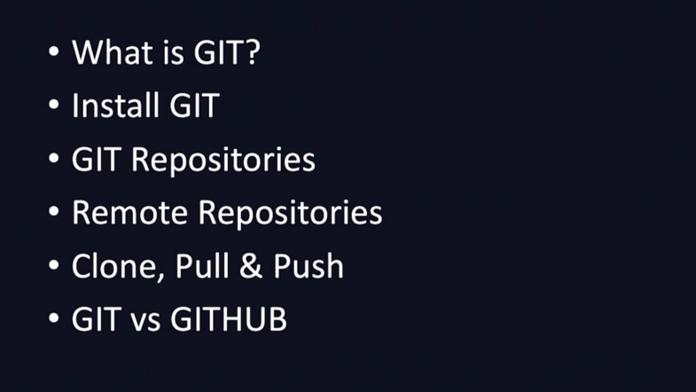

*Photo credit: KodeKloud Ltd*

### Theory

**Git** is a **Distributed Version Control System (DVCS)**. It records snapshots of your project over time so you can:

- See **what** changed, **when** it changed, and **who** changed it
- Revert to any previous working state
- Collaborate with teammates without overwriting each other's work

This module covers six pillars:

| Topic | What you will learn |
|-------|---------------------|
| What is Git? | Core concepts and why DevOps teams depend on it |
| Install Git | Get Git running on your machine |
| Git Repositories | Local repo structure and the `.git` folder |
| Remote Repositories | Central shared repos on GitHub/GitLab |
| Clone, Pull & Push | Sync code between local and remote |
| Git vs GitHub | Git = tool; GitHub = hosting platform |

**Key takeaway for students:** Git lives on your laptop. GitHub is where you publish and collaborate. You need both in real DevOps workflows.

---

## 2. Sample Python Project (Slide 2)

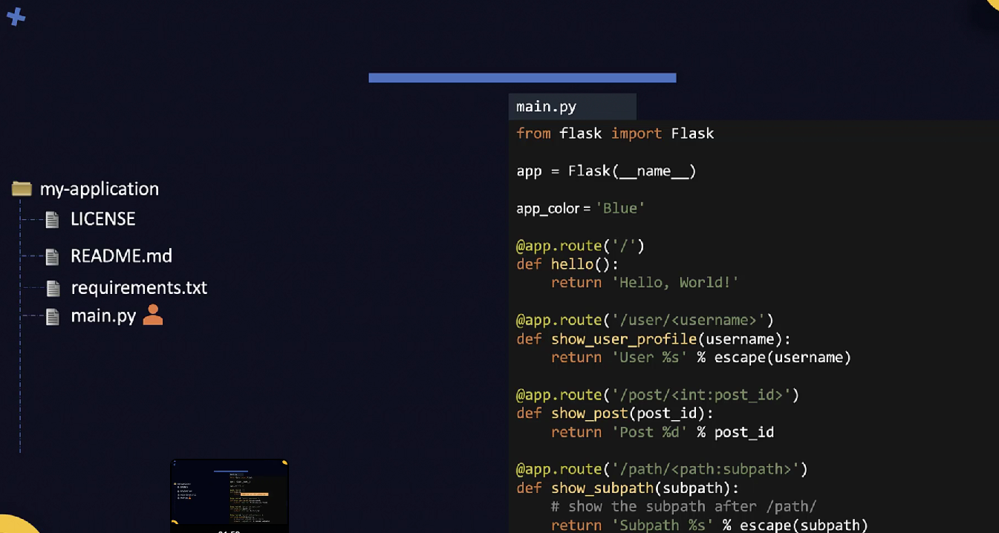

*Photo credit: KodeKloud Ltd*

### Theory

Before we touch Git, we need a **real project** to version-control. The slide shows `my-application` — a Flask web app with:

- `main.py` — application entry point with routes
- `requirements.txt` — Python dependencies
- `README.md` — project documentation
- `LICENSE` — licensing information

Flask is a lightweight Python web framework. Each `@app.route(...)` decorator maps a URL to a Python function. This is the kind of codebase DevOps engineers package, test, and deploy every day.

**Why start with a project?** Git does not manage empty folders — it tracks **files**. You always scaffold the project first, then put it under version control.

---

## 3. Source Control Management (Slide 3)

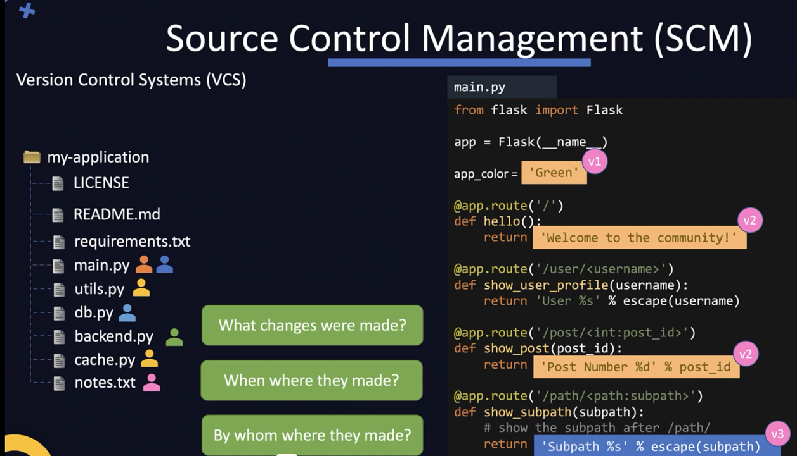

*Photo credit: KodeKloud Ltd*

### Theory

**SCM (Source Control Management)** and **VCS (Version Control Systems)** answer three questions every team asks daily:

1. **What changes were made?** — line-level diffs in files like `main.py`
2. **When were they made?** — timestamps on each commit
3. **By whom were they made?** — author metadata on each commit

The slide shows multiple contributors (color-coded person icons) editing different files:

- Orange user → `main.py`, `utils.py`
- Blue user → `db.py`
- Green user → `backend.py`
- Yellow user → `cache.py`
- Pink user → `notes.txt`

Version tags (`v1`, `v2`, `v3`) on code lines show how a file evolves across commits. Without VCS, you would end up with folders named `main_final`, `main_final_v2`, `main_REALLY_final` — a nightmare in production.

**DevOps perspective:** Every pipeline (build → test → deploy) assumes a clean, traceable Git history. SCM is the foundation of CI/CD.

---

## 4. Git Workflow Overview (Slide 4)

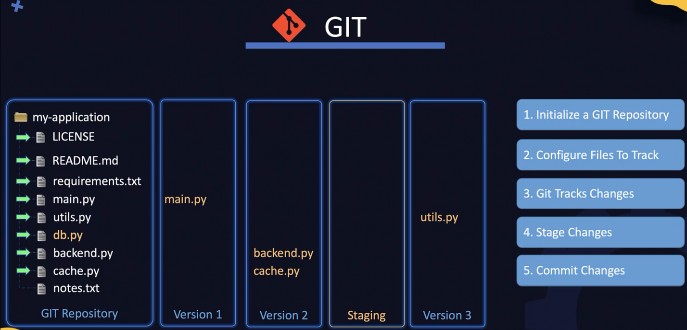

*Photo credit: KodeKloud Ltd*

### Theory

Git workflow has five repeatable steps:

```
Initialize → Configure/Track → Track Changes → Stage → Commit
```

| Step | Command(s) | Purpose |
|------|-----------|---------|
| 1. Initialize | `git init` | Create `.git` folder; start tracking |
| 2. Configure files | `git add <file>` | Tell Git which files to watch |
| 3. Track changes | (automatic) | Git detects modifications |
| 4. Stage changes | `git add <file>` | Prepare a snapshot for commit |
| 5. Commit changes | `git commit -m "message"` | Save a permanent snapshot |

The slide also shows **versions** (Version 1 → `main.py`, Version 2 → `backend.py` + `cache.py`, Version 3 → `utils.py`) and a **Staging** area — the buffer between your working directory and committed history.

**Analogy:** Staging is like packing items into a box before shipping. Commit is sealing and labeling that box with a tracking number (commit hash).

---

## 5. Install Git & Initialize Repository (Slide 5)

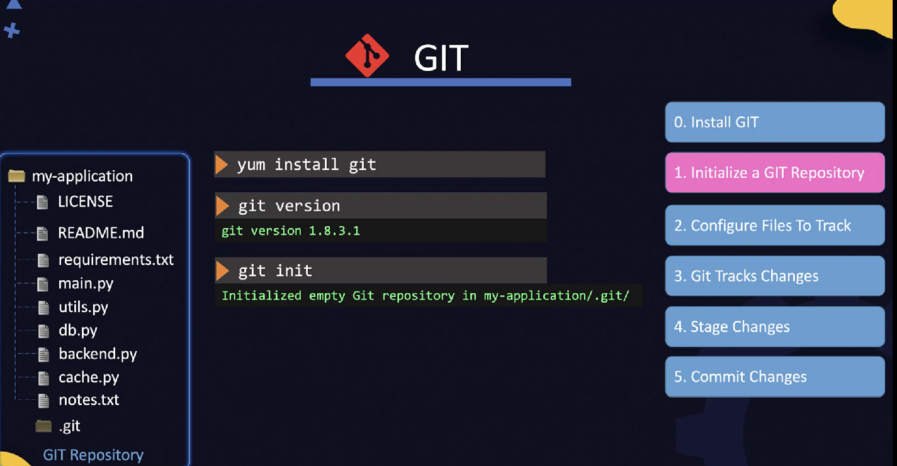

*Photo credit: KodeKloud Ltd*

### Theory

**Step 0 — Install Git**

| OS | Command |
|----|---------|
| RHEL/CentOS/Amazon Linux | `sudo yum install git` |
| Ubuntu/Debian | `sudo apt install git` |
| macOS | `brew install git` |
| Windows | Download from [git-scm.com](https://git-scm.com/) or use `winget install Git.Git` |

Verify installation:

```bash
git version
# Example output: git version 2.43.0
```

**Step 1 — Initialize a Git repository**

```bash
cd my-application
git init
# Initialized empty Git repository in my-application/.git/
```

Running `git init` creates a hidden `.git` directory. This folder stores all history, branches, and configuration. **Never delete `.git`** unless you want to remove version control entirely.

---

## 6. Configure Files to Track (Slide 6)

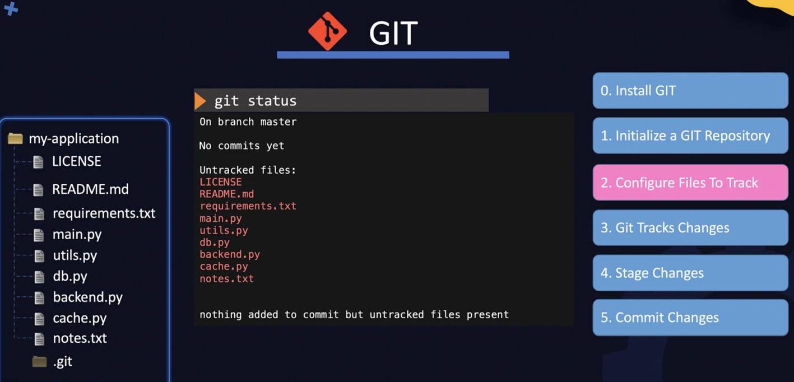

*Photo credit: KodeKloud Ltd*

### Theory

After `git init`, Git sees your files but does **not** track them yet. They are **untracked**.

```bash
git status
```

Expected output:

```
On branch master
No commits yet

Untracked files:
  LICENSE
  README.md
  requirements.txt
  main.py
  utils.py
  db.py
  backend.py
  cache.py
  notes.txt

nothing added to commit but untracked files present
```

**Three file states in Git:**

| State | Meaning |
|-------|---------|
| Untracked | Git ignores the file |
| Staged | File is in the staging area, ready to commit |
| Committed | File is saved in Git history |

**Best practice:** Create a `.gitignore` file early to exclude files that should never be committed (virtual environments, `.env`, `__pycache__/`).

---

## 7. Stage Files with git add (Slide 7)

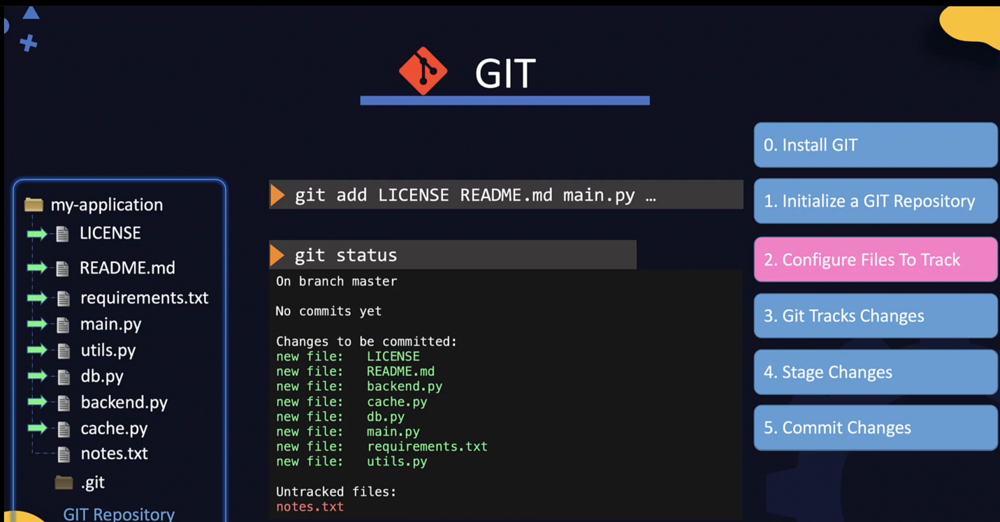

*Photo credit: KodeKloud Ltd*

### Theory

**Step 2 — Configure which files Git tracks** using `git add`:

```bash
# Stage specific files
git add LICENSE README.md main.py requirements.txt

# Or stage everything at once
git add .
```

After staging:

```bash
git status
```

```
Changes to be committed:
  new file: LICENSE
  new file: README.md
  new file: main.py
  ...

Untracked files:
  notes.txt
```

Notice `notes.txt` remains **untracked** because we did not `git add` it. This is intentional — not every file belongs in version control (personal notes, secrets, temp files).

**Rule of thumb:** Stage only files that belong in the shared codebase.

---

## 8. Git Tracks Changes (Slide 8)

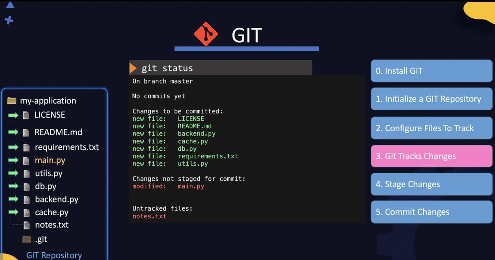

*Photo credit: KodeKloud Ltd*

### Theory

**Step 3 — Git automatically tracks changes** to files you have already staged or committed.

Scenario from the slide:

1. You staged `main.py` and other files
2. You edited `main.py` again **after** staging
3. `git status` now shows:

```
Changes to be committed:
  new file: main.py    ← old staged version

Changes not staged for commit:
  modified: main.py    ← new edits not yet staged
```

This is normal. Git compares three areas:

```
Working Directory  →  Staging Area  →  Repository (commits)
     (edit)              (git add)         (git commit)
```

**Student tip:** If `git status` shows a file in both "staged" and "modified", you need to `git add` it again to include the latest edits in your next commit.

---

## 9. Stage Modified Files (Slide 9)

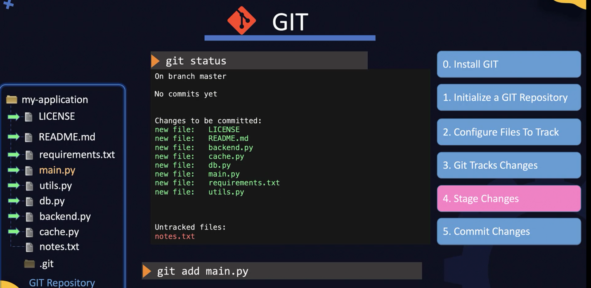

*Photo credit: KodeKloud Ltd*

### Theory

**Step 4 — Re-stage modified files** before committing:

```bash
git add main.py
git status
```

Now `main.py` appears only under "Changes to be committed" with the latest content.

Quick staging shortcuts:

| Command | Action |
|---------|--------|
| `git add main.py` | Stage one file |
| `git add .` | Stage all changes in current directory |
| `git add -A` | Stage all changes in entire repo |
| `git restore --staged main.py` | Unstage a file (keep changes on disk) |

---

## 10. Commit Changes (Slide 10)

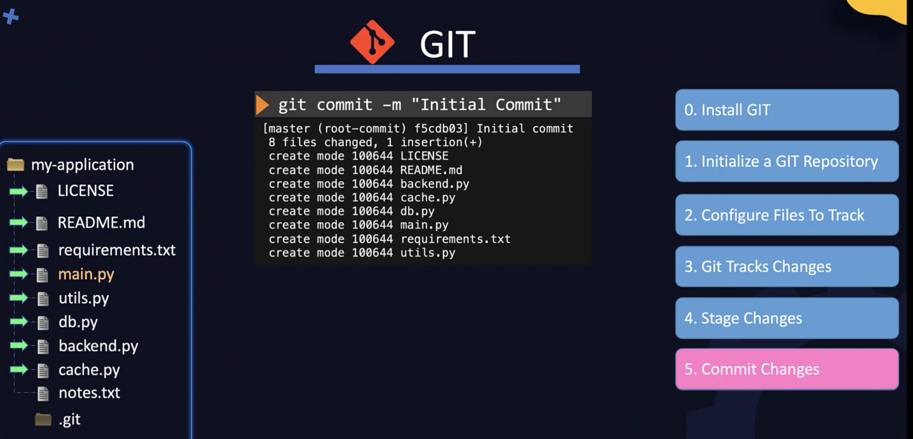

*Photo credit: KodeKloud Ltd*

### Theory

**Step 5 — Commit** creates a permanent snapshot:

```bash
git commit -m "Initial Commit"
```

Output:

```
[master (root-commit) f5cdb03] Initial Commit
 8 files changed, 1 insertion(+)
 create mode 100644 LICENSE
 create mode 100644 README.md
 ...
```

Key details:

- **`f5cdb03`** — short commit hash (unique ID for this snapshot)
- **`root-commit`** — this is the very first commit in the repo
- **8 files** committed; `notes.txt` was never added, so it is not in history

**Commit message rules (industry standard):**

- Use imperative mood: `"Add login route"` not `"Added login route"`
- Keep subject line under 50 characters
- Explain *why*, not just *what*, in the body if needed

```bash
git log --oneline    # View commit history
git show f5cdb03     # Inspect a specific commit
```

---

## 11. Multiple Local Repositories (Slide 11)

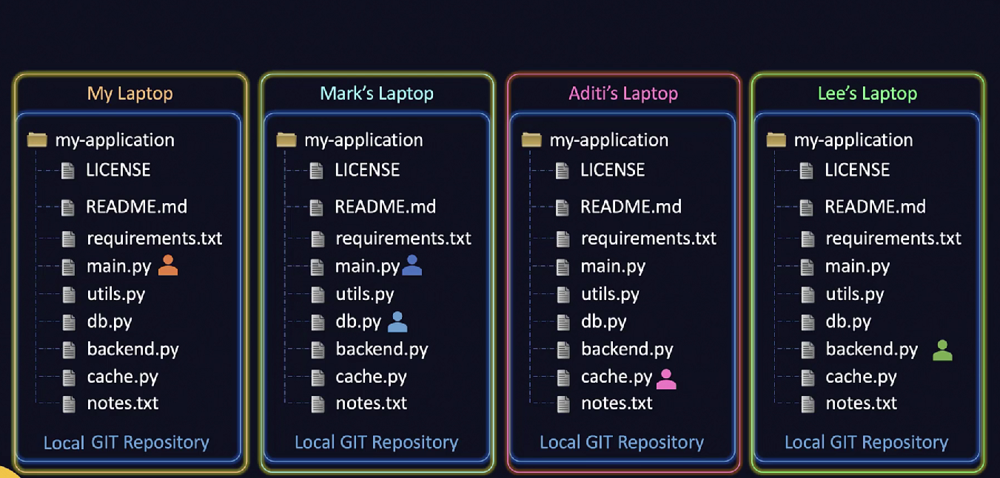

*Photo credit: KodeKloud Ltd*

### Theory

When four developers each have their **own local copy**, problems appear quickly:

| Developer | Editing |
|-----------|---------|
| My Laptop | `main.py` |
| Mark's Laptop | `main.py`, `db.py` |
| Aditi's Laptop | `cache.py` |
| Lee's Laptop | `backend.py` |

**Problem:** Mark and "My Laptop" both edit `main.py` independently. How do you merge two different versions?

**Solution:** A **remote repository** — one central source of truth everyone pushes to and pulls from. This is the foundation of GitHub/GitLab workflows.

---

## 12. Push to Remote (Slide 12)

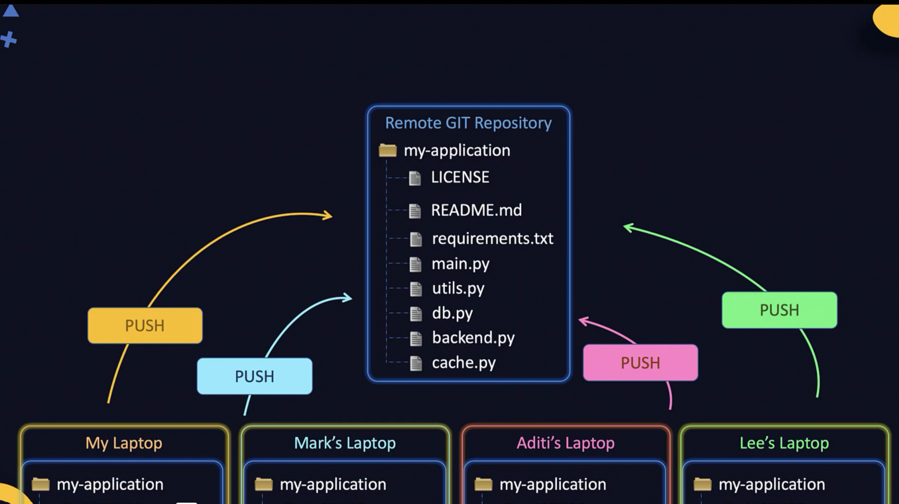

*Photo credit: KodeKloud Ltd*

### Theory

**`git push`** uploads your local commits to the remote repository:

```
Local Laptop  ──PUSH──▶  Remote Repository
```

Each developer pushes their committed work. The remote repo accumulates everyone's changes (Git merges them when possible).

```bash
git push <remote-name> <branch-name>
# Example:
git push origin master
```

**Important:** You can only push **commits**. Uncommitted or unstaged changes are not uploaded.

---

## 13. Pull from Remote (Slide 13)

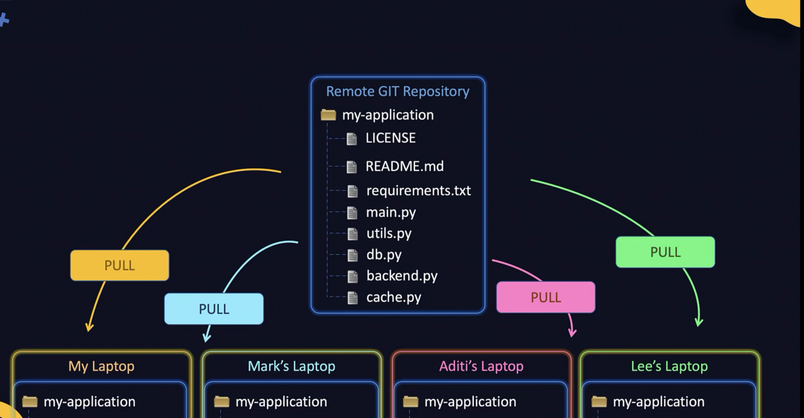

*Photo credit: KodeKloud Ltd*

### Theory

**`git pull`** downloads changes from the remote and merges them into your local branch:

```
Remote Repository  ──PULL──▶  Local Laptop
```

```bash
git pull origin master
```

`git pull` is actually two commands combined:

1. `git fetch` — download new commits from remote
2. `git merge` — merge those commits into your current branch

**Daily DevOps habit:** Always `git pull` before starting work to avoid working on stale code.

---

## 14. Remote Hosting — GitHub & GitLab (Slide 14)

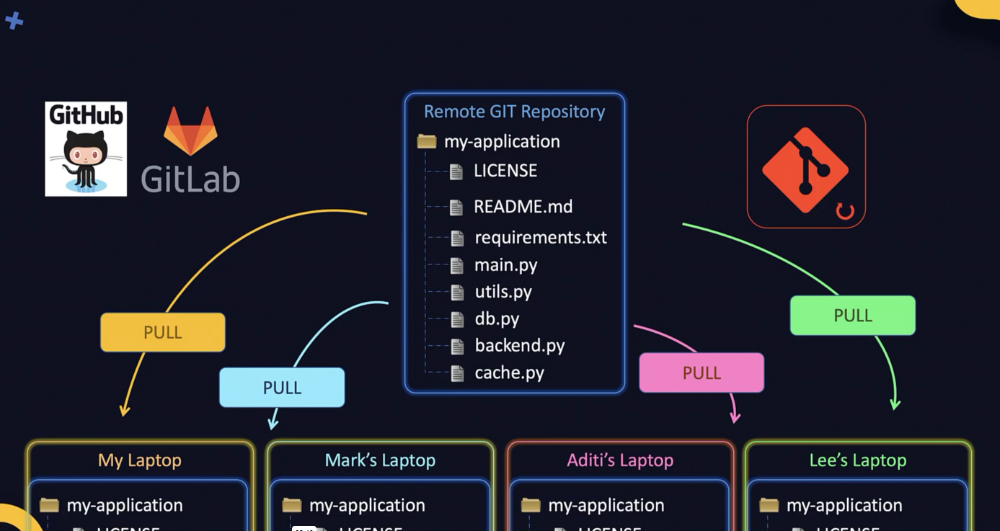

*Photo credit: KodeKloud Ltd*

### Theory

| Tool | Role |
|------|------|
| **Git** | Version control engine (local) |
| **GitHub** | Cloud hosting for Git repos + PRs, Actions, Issues |
| **GitLab** | Similar to GitHub; popular for self-hosted/on-prem setups |

Both GitHub and GitLab provide:

- Web UI for browsing code and history
- Pull/Merge Request workflows for code review
- CI/CD integration (GitHub Actions, GitLab CI)
- Access control and team permissions

**Git vs GitHub — do not confuse them:**

> Git is the tool. GitHub is the platform. You can use Git without GitHub, but most teams use both.

---

## 15. Local Setup → GitHub (Slide 15)

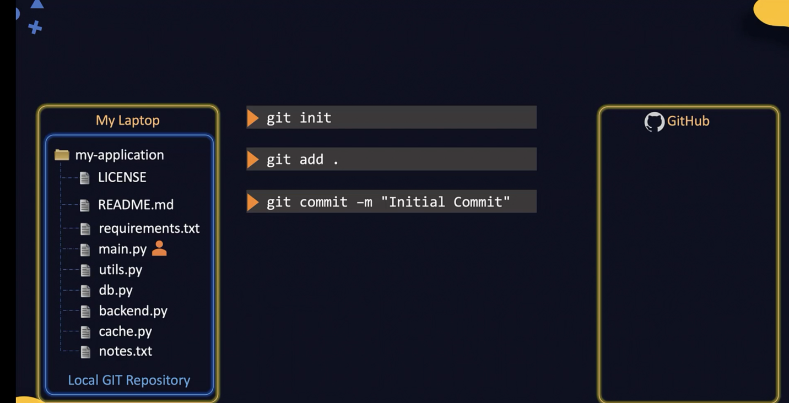

*Photo credit: KodeKloud Ltd*

### Theory

The end-to-end flow from zero to GitHub:

```
1. git init
2. git add .
3. git commit -m "Initial Commit"
4. (Create repo on GitHub)
5. git remote add origin <url>
6. git push -u origin master
```

The slide shows the GitHub box empty until you push — the remote repo exists but has no code until step 6.

---

## 16. Create GitHub Repository (Slide 16)

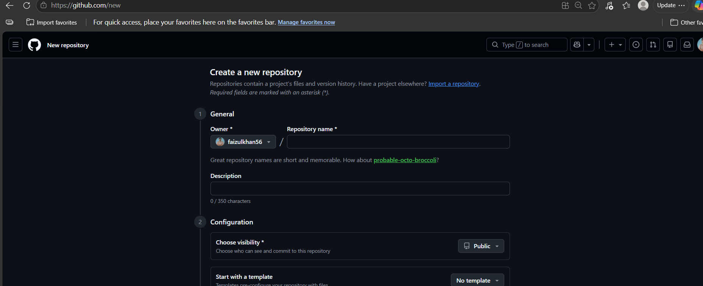

*Photo credit: KodeKloud Ltd*

### Theory

On GitHub, go to **https://github.com/new** and fill in:

| Field | Recommendation |
|-------|---------------|
| Owner | Your GitHub username |
| Repository name | `my-application` (match your local folder name) |
| Description | Short summary of the project |
| Visibility | Public (learning) or Private (work projects) |
| Initialize with README | **Leave unchecked** if you already have local files |

Click **Create repository**. GitHub will show you the remote URL:

```
https://github.com/<your-username>/my-application.git
```

---

## 17. Empty GitHub Repo — Quick Setup (Slide 17)

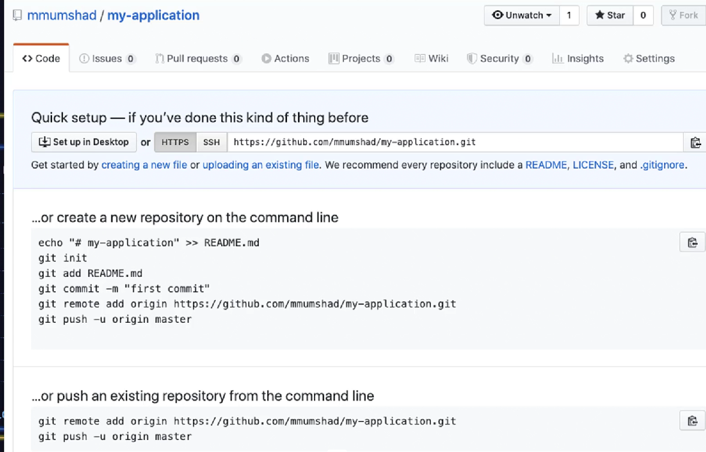

*Photo credit: KodeKloud Ltd*

### Theory

A freshly created GitHub repo shows two command blocks:

**Option A — Push an existing local repository (our case):**

```bash
git remote add origin https://github.com/mmumshad/my-application.git
git branch -M main
git push -u origin main
```

**Option B — Start from scratch on GitHub:**

```bash
echo "# my-application" >> README.md
git init
git add README.md
git commit -m "first commit"
git remote add origin https://github.com/mmumshad/my-application.git
git push -u origin main
```

The `-u` flag sets **upstream tracking** so future pushes need only `git push`.

> **Note:** Modern GitHub defaults to `main` as the default branch. Older slides show `master` — both work; be consistent within your project.

---

## 18. Push — Detailed Commands (Slide 18)

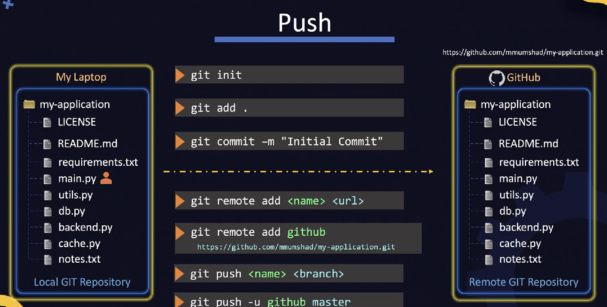

*Photo credit: KodeKloud Ltd*

### Theory

Complete push workflow:

```bash
# 1. Initialize and commit locally
git init
git add .
git commit -m "Initial Commit"

# 2. Link remote
git remote add github https://github.com/mmumshad/my-application.git

# 3. Push and set upstream
git push -u github master
```

Verify remote is configured:

```bash
git remote -v
# github  https://github.com/mmumshad/my-application.git (fetch)
# github  https://github.com/mmumshad/my-application.git (push)
```

After a successful push, your GitHub repo mirrors your local file tree.

---

## 19. Clone (Slide 19)

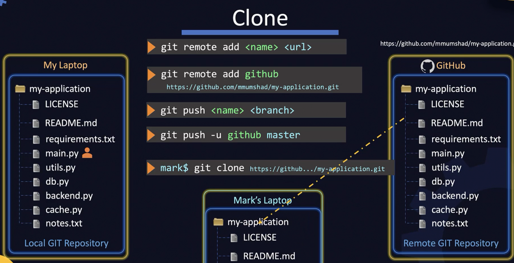

*Photo credit: KodeKloud Ltd*

### Theory

**`git clone`** creates a full local copy of a remote repository:

```bash
git clone https://github.com/mmumshad/my-application.git
cd my-application
```

What clone gives you:

- All files from the latest commit
- Complete Git history (`.git` folder included)
- Remote `origin` pre-configured pointing to the source URL

Mark (second developer) runs clone once. After that, he uses `git pull` / `git push` for daily sync.

**Clone vs Fork:**

| Command | Use case |
|---------|----------|
| `git clone` | Copy a repo you have push access to |
| Fork (GitHub UI) | Copy someone else's repo to your account, then clone your fork |

---

## 20. Clone + Remote Verification (Slide 20)

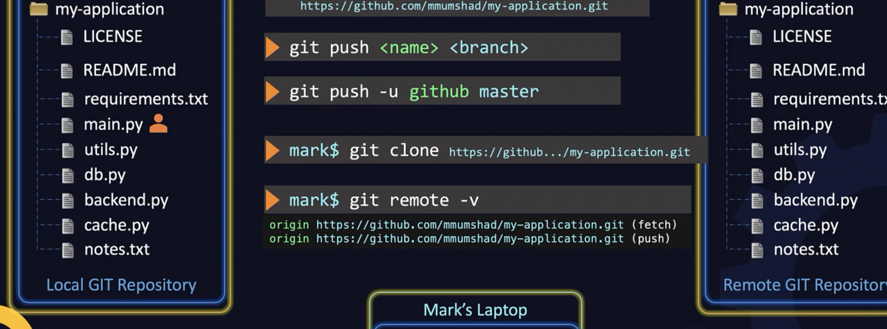

*Photo credit: KodeKloud Ltd*

### Theory

After cloning, always verify the remote:

```bash
mark$ git clone https://github.com/mmumshad/my-application.git
mark$ cd my-application
mark$ git remote -v
```

Output:

```
origin  https://github.com/mmumshad/my-application.git (fetch)
origin  https://github.com/mmumshad/my-application.git (push)
```

`origin` is the default remote name Git assigns during clone. Both fetch (pull) and push URLs point to the same repository.

Other useful remote commands:

```bash
git remote rename origin github     # Rename remote
git remote remove origin            # Remove remote link
git remote add upstream <url>       # Add a second remote (common in fork workflows)
```

---

## 21. Pull — Complete Remote Workflow (Slide 21)

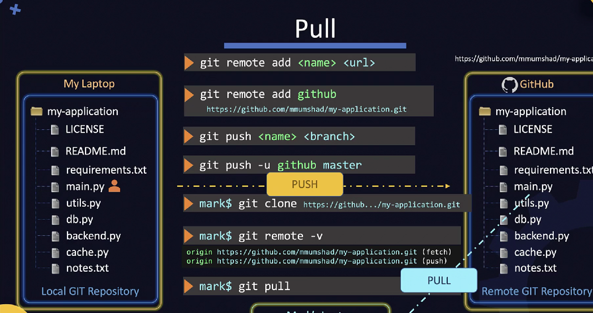

*Photo credit: KodeKloud Ltd*

### Theory

The complete collaboration cycle:

```
Developer A:  edit → add → commit → PUSH → Remote
Developer B:  Remote → PULL → edit → add → commit → PUSH → Remote
```

Mark's daily workflow after initial clone:

```bash
# Start of day — get latest code
git pull

# Do your work, then
git add .
git commit -m "Update db connection logic"
git push
```

**Golden rules for team Git:**

1. Pull before you start working
2. Commit often with clear messages
3. Push when a logical unit of work is done
4. Never force-push to shared branches (`git push --force` destroys teammates' work)

---

## Hands-On Lab: Full Python Project Scaffolding → GitHub

This lab walks you through **every step** from an empty folder to a live GitHub repository. Follow in order — do not skip steps.

### Prerequisites

- Python 3.10+ installed (`python --version`)
- Git installed (`git --version`)
- A GitHub account

---

### Step 1 — Create the project folder

```bash
mkdir testpython
cd testpython
```

---

### Step 2 — Scaffold the Python project structure

```bash
# Create source files
touch main.py utils.py db.py backend.py cache.py
touch requirements.txt README.md LICENSE
mkdir -p tests
touch tests/__init__.py tests/test_main.py
```

Your folder should look like this:

```
testpython/
├── LICENSE
├── README.md
├── requirements.txt
├── main.py
├── utils.py
├── db.py
├── backend.py
├── cache.py
└── tests/
    ├── __init__.py
    └── test_main.py
```

---

### Step 3 — Add application code

**`main.py`**

```python
from flask import Flask, escape

app = Flask(__name__)

app_color = "Blue"


@app.route("/")
def hello():
    return "Hello, World!"


@app.route("/user/<username>")
def show_user_profile(username):
    return "User %s" % escape(username)


@app.route("/post/<int:post_id>")
def show_post(post_id):
    return "Post %d" % post_id


@app.route("/path/<path:subpath>")
def show_subpath(subpath):
    return "Subpath %s" % escape(subpath)


if __name__ == "__main__":
    app.run(debug=True)
```

**`requirements.txt`**

```
flask==3.0.0
pytest==8.0.0
```

**`utils.py`**, **`db.py`**, **`backend.py`**, **`cache.py`** — add placeholder modules:

```python
# utils.py
def format_response(data):
    return {"status": "ok", "data": data}
```

```python
# db.py
def get_connection():
    return "sqlite:///app.db"
```

```python
# backend.py
def process_request(payload):
    return payload
```

```python
# cache.py
_cache = {}

def get(key):
    return _cache.get(key)

def set(key, value):
    _cache[key] = value
```

---

### Step 4 — Create and activate a virtual environment

```bash
# Create virtual environment
python -m venv venv

# Activate (choose your OS)
# Linux/macOS:
source venv/bin/activate
# Windows PowerShell:
.\venv\Scripts\Activate.ps1
# Windows CMD:
venv\Scripts\activate.bat
```

---

### Step 5 — Install dependencies from requirements.txt

```bash
pip install -r requirements.txt
```

Verify Flask installed:

```bash
pip list | grep -i flask
# flask    3.0.0
```

---

### Step 6 — Run the application (smoke test)

```bash
python main.py
```

Open **http://127.0.0.1:5000/** in your browser. You should see `Hello, World!`.  
Press `Ctrl+C` to stop the server.

Run tests:

```bash
pytest tests/ -v
```

---

### Step 7 — Create `.gitignore`

Never commit virtual environments or cache files:

```bash
cat > .gitignore << 'EOF'
venv/
__pycache__/
*.pyc
.env
*.db
.DS_Store
EOF
```

---

### Step 8 — Initialize Git

```bash
git init
git status
# All project files appear as "Untracked"
```

---

### Step 9 — Stage files

```bash
git add LICENSE README.md requirements.txt main.py utils.py db.py backend.py cache.py tests/ .gitignore
git status
# Files appear under "Changes to be committed"
```

---

### Step 10 — First commit

```bash
git commit -m "Initial Commit: scaffold Flask testpython project"
```

Verify:

```bash
git log --oneline
# abc1234 Initial Commit: scaffold Flask testpython project
```

---

### Step 11 — Create GitHub repository

1. Go to **https://github.com/new**
2. Repository name: `testpython`
3. Visibility: Public
4. **Do not** check "Add a README" (you already have one locally)
5. Click **Create repository**

Copy the HTTPS URL shown:

```
https://github.com/<your-username>/testpython.git
```

---

### Step 12 — Link local repo to GitHub remote

```bash
git remote add origin https://github.com/<your-username>/testpython.git
git remote -v
```

---

### Step 13 — Push to GitHub

```bash
git branch -M main
git push -u origin main
```

Refresh your GitHub repo page — all files should appear.

---

### Lab checklist

- [ ] Project folder created and scaffolded
- [ ] Virtual environment created and activated
- [ ] Dependencies installed from `requirements.txt`
- [ ] App runs locally (`Hello, World!`)
- [ ] `.gitignore` excludes `venv/` and `__pycache__/`
- [ ] Git initialized, files staged and committed
- [ ] GitHub repo created
- [ ] Remote added and code pushed

---

## Branching, Pull Requests & Merge to Main

> This section covers workflows **beyond the slide deck** — essential for every DevOps team.

### Why branches?

The `main` branch represents **production-ready code**. Developers create **feature branches** so incomplete work never breaks the main codebase.

```
main:           A ─── B ─── C ─────────────── G (merge)
                         \                   /
feature/login:            D ─── E ─── F ────
```

---

### Step 1 — Create and switch to a feature branch

```bash
# Make sure you are on main and up to date
git checkout main
git pull origin main

# Create and switch to a new branch
git checkout -b feature/add-health-check
# Modern alternative:
git switch -c feature/add-health-check
```

Verify:

```bash
git branch
# * feature/add-health-check
#   main
```

---

### Step 2 — Make changes on the feature branch

Add a health-check endpoint to `main.py`:

```python
@app.route("/health")
def health():
    return {"status": "healthy"}, 200
```

Stage, commit, and push the branch:

```bash
git add main.py
git commit -m "Add /health endpoint for load balancer checks"
git push -u origin feature/add-health-check
```

---

### Step 3 — Create a Pull Request (PR) on GitHub

1. Go to your repo on GitHub
2. You will see a banner: **"feature/add-health-check had recent pushes"** → click **Compare & pull request**
3. Fill in the PR form:

   | Field | Example |
   |-------|---------|
   | Title | `Add /health endpoint for load balancer checks` |
   | Description | What changed, why, how to test |
   | Base branch | `main` |
   | Compare branch | `feature/add-health-check` |

4. Click **Create pull request**

**What is a PR?** A request to merge your branch into `main`. It enables:

- Code review by teammates
- Automated CI checks (tests, linting)
- Discussion before merging

---

### Step 4 — Review and merge to main

After approval and passing CI checks:

**Option A — Merge via GitHub UI (recommended for teams):**

1. Open the PR on GitHub
2. Click **Merge pull request** → **Confirm merge**
3. Click **Delete branch** (cleanup)

**Option B — Merge locally:**

```bash
git checkout main
git pull origin main
git merge feature/add-health-check
git push origin main
```

Verify:

```bash
git log --oneline --graph
# * abc1234 (HEAD -> main) Merge pull request #1 from feature/add-health-check
# |\
# | * def5678 Add /health endpoint for load balancer checks
# |/
# * 789abcd Initial Commit: scaffold Flask testpython project
```

---

### Step 5 — Clean up the feature branch

```bash
git branch -d feature/add-health-check          # Delete local branch
git push origin --delete feature/add-health-check  # Delete remote branch
```

---

### Branch naming conventions (industry standard)

| Pattern | Example | Use case |
|---------|---------|----------|
| `feature/<name>` | `feature/add-health-check` | New functionality |
| `bugfix/<name>` | `bugfix/fix-db-connection` | Bug fixes |
| `hotfix/<name>` | `hotfix/patch-security-flaw` | Urgent production fix |
| `release/<version>` | `release/v1.2.0` | Release preparation |

---

## Merge Conflicts — Create, Detect & Resolve

> Merge conflicts happen when **two branches edit the same lines** in the same file. Git cannot decide which version to keep — **you** must decide.

---

### Scenario setup

We will simulate a conflict between `main` and a feature branch both editing `main.py`.

---

### Step 1 — Prepare main branch with one version

```bash
git checkout main
git pull origin main
```

Ensure `main.py` has:

```python
app_color = "Blue"

@app.route("/")
def hello():
    return "Hello, World!"
```

Commit if needed:

```bash
git add main.py
git commit -m "Set app color to Blue on main"
git push origin main
```

---

### Step 2 — Create a feature branch and make conflicting edits

```bash
git checkout -b feature/change-greeting
```

Edit `main.py` on the feature branch:

```python
app_color = "Green"

@app.route("/")
def hello():
    return "Welcome to the community!"
```

Commit and push:

```bash
git add main.py
git commit -m "Change greeting and color to Green"
git push -u origin feature/change-greeting
```

---

### Step 3 — Create a conflicting change on main (simulating another developer)

Switch back to main and make a **different edit to the same lines**:

```bash
git checkout main
```

Edit `main.py`:

```python
app_color = "Red"

@app.route("/")
def hello():
    return "Hello from Production!"
```

Commit and push:

```bash
git add main.py
git commit -m "Set app color to Red and update greeting on main"
git push origin main
```

Now both branches changed `app_color` and the `hello()` return string differently.

---

### Step 4 — Attempt merge — conflict appears

```bash
git merge feature/change-greeting
```

Git output:

```
Auto-merging main.py
CONFLICT (content): Merge conflict in main.py
Automatic merge failed; fix conflicts and then commit the result.
```

Check status:

```bash
git status
# both modified: main.py
# Unmerged paths
```

---

### Step 5 — Read the conflict markers

Open `main.py`. Git inserts conflict markers:

```python
<<<<<<< HEAD
app_color = "Red"

@app.route("/")
def hello():
    return "Hello from Production!"
=======
app_color = "Green"

@app.route("/")
def hello():
    return "Welcome to the community!"
>>>>>>> feature/change-greeting
```

| Marker | Meaning |
|--------|---------|
| `<<<<<<< HEAD` | Start of **your current branch** (main) version |
| `=======` | Separator |
| `>>>>>>> feature/change-greeting` | End of **incoming branch** version |

---

### Step 6 — Resolve the conflict manually

Decide the final merged code. As the team lead, you choose to keep the feature greeting but use main's color:

```python
app_color = "Red"

@app.route("/")
def hello():
    return "Welcome to the community!"
```

**Delete all conflict markers** (`<<<<<<<`, `=======`, `>>>>>>>`).

---

### Step 7 — Stage the resolved file and complete the merge

```bash
git add main.py
git commit -m "Merge feature/change-greeting: keep Red color, use community greeting"
```

If you want to abort instead:

```bash
git merge --abort    # Cancels merge, returns to pre-merge state
```

---

### Step 8 — Push the resolved merge

```bash
git push origin main
```

Verify clean history:

```bash
git log --oneline --graph --all
```

---

### Merge conflict resolution cheat sheet

| Situation | Command |
|-----------|---------|
| See conflict markers | Edit file manually, remove markers |
| Want their version entirely | `git checkout --theirs main.py` |
| Want your version entirely | `git checkout --ours main.py` |
| After resolving | `git add <file>` then `git commit` |
| Want to cancel merge | `git merge --abort` |
| See which files conflict | `git status` |
| Use a visual tool | `git mergetool` |

---

### How to avoid merge conflicts (team best practices)

1. **Pull before you push** — always sync with `main` first
2. **Keep branches short-lived** — merge feature branches within days, not weeks
3. **Communicate** — tell teammates which files you are editing
4. **Small, focused commits** — easier to review and merge
5. **Rebase or merge main into your branch** before opening a PR:

   ```bash
   git checkout feature/my-branch
   git merge main          # or: git rebase main
   # Fix any conflicts locally before pushing
   git push
   ```

---

## Quick Reference — Essential Git Commands

| Task | Command |
|------|---------|
| Initialize repo | `git init` |
| Check status | `git status` |
| Stage file | `git add <file>` |
| Stage all | `git add .` |
| Commit | `git commit -m "message"` |
| View history | `git log --oneline --graph` |
| Create branch | `git checkout -b <branch>` |
| Switch branch | `git checkout <branch>` |
| Merge branch | `git merge <branch>` |
| Add remote | `git remote add origin <url>` |
| Push | `git push -u origin <branch>` |
| Pull | `git pull origin <branch>` |
| Clone | `git clone <url>` |
| Abort merge | `git merge --abort` |

---

## Summary

| Phase | Slides | What you learned |
|-------|--------|-----------------|
| Concepts | 1–3 | Why SCM/VCS matters |
| Local Git | 4–10 | init → add → commit workflow |
| Collaboration | 11–14 | Multiple devs, push, pull, remote hosting |
| GitHub | 15–21 | Create repo, push, clone, pull |
| Lab | — | Full Python project scaffolding to GitHub |
| Advanced | — | Branching, PRs, merge to main |
| Conflicts | — | Create, detect, and resolve merge conflicts |

---

*Slide images © KodeKloud Ltd. This guide is for educational purposes.*
