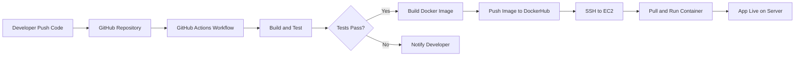
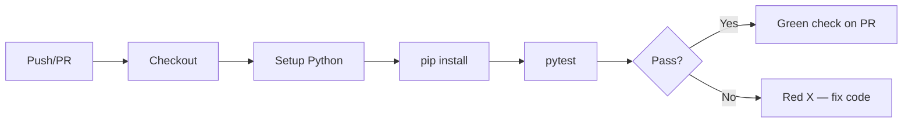
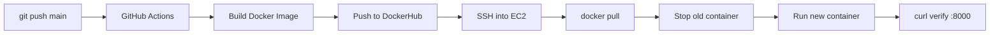
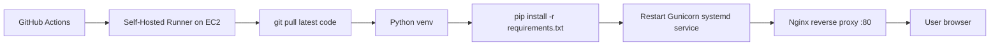

# GitHub Actions Basic Tutorial

> **For students:** This tutorial teaches GitHub Actions from zero. Work through each workflow example in order (`01` → `16`). Copy any workflow into your repo at `.github/workflows/` to run it.
>
> **Prerequisite:** Complete the Git & GitHub basics in the sibling folder [`../git_basic/`](../git_basic/).

---

## How to Use This Tutorial

```
github_action_basic/
├── README.md              ← You are here (full theory + explanations)
└── workflows/
    ├── 01-hello-world.yml
    ├── 02-job-step-run.yml
    ├── ...
    └── 16-ec2-docker-deploy-basic.yml
```

**Important:** Workflow files in `workflows/` are **learning examples**. GitHub only runs workflows inside `.github/workflows/` at the **root of your repository**. To test a workflow:

```bash
# In your GitHub repo (Git Bash on Windows)
mkdir -p .github/workflows
cp workflows/01-hello-world.yml .github/workflows/
git add .github/workflows/01-hello-world.yml
git commit -m "Add hello world workflow"
git push origin main
```

Then go to your repo on GitHub → **Actions** tab → select the workflow → **Run workflow**.

---

## Table of Contents

1. [What is GitHub Actions?](#1-what-is-github-actions)
2. [Why do we use GitHub Actions?](#2-why-do-we-use-github-actions)
3. [GitHub Actions Core Terms](#3-github-actions-core-terms)
4. [Basic Workflow Structure](#4-basic-workflow-structure)
5. [Workflow Example 01: Hello World](#5-workflow-example-01-hello-world)
6. [Workflow Example 02: Job, Step, Run](#6-workflow-example-02-job-step-run)
7. [Workflow Example 03: Using Marketplace Actions](#7-workflow-example-03-using-marketplace-actions)
8. [Environment Variables](#8-environment-variables)
9. [Repository Variables](#9-repository-variables)
10. [Secrets](#10-secrets)
11. [Manual Trigger and Inputs](#11-manual-trigger-and-inputs)
12. [Auto Triggers](#12-auto-triggers)
13. [Matrix Build](#13-matrix-build)
14. [Python CI Example](#14-python-ci-example)
15. [Node.js CI Example](#15-nodejs-ci-example)
16. [Java CI Example](#16-java-ci-example)
17. [Docker Build Basic](#17-docker-build-basic)
18. [End-to-End Dockerized CI/CD to AWS EC2](#18-end-to-end-dockerized-cicd-to-aws-ec2)
19. [Required GitHub Secrets for EC2 Docker Deployment](#19-required-github-secrets-for-ec2-docker-deployment)
20. [AWS EC2 Basic Setup](#20-aws-ec2-basic-setup)
21. [Self-Hosted Runner](#21-self-hosted-runner)
22. [Self-Hosted Runner Setup on AWS EC2](#22-self-hosted-runner-setup-on-aws-ec2)
23. [Non-Docker Python Deployment with WSGI](#23-non-docker-python-deployment-with-wsgi)
24. [Student Practice Tasks](#24-student-practice-tasks)
25. [Final Learning Path](#25-final-learning-path)

---

## 1. What is GitHub Actions?

**GitHub Actions** is a built-in automation platform inside GitHub. It runs tasks automatically when something happens in your repository — for example, when you push code, open a pull request, or click a manual "Run" button.

Think of it as a robot assistant living inside your GitHub repo. You write a recipe (called a **workflow**), and GitHub runs that recipe on a virtual machine (called a **runner**) whenever a trigger event occurs.

**Real-world examples:**

- Run tests every time someone pushes code
- Build a Docker image and deploy to AWS EC2
- Send a Slack notification when a deployment fails
- Run a security scan every night at midnight

You do not need a separate CI/CD server. If your code is on GitHub, you can automate directly there.

---

## 2. Why do we use GitHub Actions?

| Reason | What it means for you |
|--------|----------------------|
| **Automation** | Stop doing repetitive tasks manually |
| **CI (Continuous Integration)** | Test every code change automatically |
| **CD (Continuous Deployment)** | Deploy to servers after tests pass |
| **Consistency** | Same build/test steps every time |
| **Speed** | Catch bugs before they reach production |
| **Visibility** | See pass/fail status on every commit and PR |

### CI/CD flow (high level)



**DevOps mindset:** Every push should trigger a pipeline. If the pipeline fails, fix it before merging.

---

## 3. GitHub Actions Core Terms

| Term | Simple explanation |
|------|-------------------|
| **Workflow** | A YAML file that defines an automated process. Lives in `.github/workflows/`. |
| **Event** | What triggers the workflow (`push`, `pull_request`, `schedule`, `workflow_dispatch`). |
| **Job** | A group of steps that run on the same runner. Jobs can run in parallel or depend on each other. |
| **Step** | A single task inside a job — either a `run` command or a `uses` action. |
| **Runner** | The machine that executes your workflow (GitHub-hosted or self-hosted). |
| **Action** | A reusable unit of automation (from Marketplace or your own repo). |
| **`run`** | Execute a shell command directly in the runner. |
| **`uses`** | Run a pre-built Marketplace action. |
| **`.github/workflows`** | The folder where GitHub looks for workflow YAML files. |
| **Marketplace** | A catalog of pre-built actions at [github.com/marketplace](https://github.com/marketplace?type=actions). |
| **Artifact** | A file saved from a workflow run (build output, test reports). |
| **Secret** | Encrypted value (passwords, API keys, SSH keys). Never visible in logs. |
| **Variable** | Plain-text config value (environment name, region). Not encrypted. |
| **Matrix** | Run the same job across multiple combinations (Python 3.10, 3.11, 3.12). |

### GitHub-hosted runner vs self-hosted runner

| Type | Runs on | Best for |
|------|---------|----------|
| **GitHub-hosted** | GitHub's cloud (`ubuntu-latest`, `windows-latest`) | Most CI/CD, learning, open source |
| **Self-hosted** | Your own server (e.g. AWS EC2) | Deploy to same machine, private network access |

---

## 4. Basic Workflow Structure

Every workflow YAML file follows this skeleton:

```yaml
name: My Workflow Name          # Display name in Actions tab

on:                             # Event trigger(s)
  push:
    branches: [main]

jobs:                           # One or more jobs
  job-name:                     # Job identifier
    runs-on: ubuntu-latest      # Runner OS

    steps:                      # Ordered list of tasks
      - name: Step description
        run: echo "Hello"       # Shell command

      - name: Use an action
        uses: actions/checkout@v4
```

### Key rules

- **Indentation matters** — YAML uses spaces (2 spaces per level)
- **Order matters** — steps run top to bottom
- **Jobs run in parallel** by default — use `needs:` to create dependencies
- **Expressions** use `${{ }}` syntax — e.g. `${{ github.ref_name }}` for branch name

### Built-in context variables (commonly used)

| Expression | Meaning |
|-----------|---------|
| `${{ github.repository }}` | `owner/repo-name` |
| `${{ github.ref_name }}` | Branch or tag name |
| `${{ github.sha }}` | Commit hash |
| `${{ github.actor }}` | Username who triggered the workflow |
| `${{ secrets.MY_SECRET }}` | Encrypted secret value |
| `${{ vars.MY_VAR }}` | Repository variable value |

---

## 5. Workflow Example 01: Hello World

**File:** [`workflows/01-hello-world.yml`](workflows/01-hello-world.yml)

This is your first workflow. It does three things:

1. Triggers manually (`workflow_dispatch`)
2. Runs on `ubuntu-latest`
3. Prints hello message, date, and OS info

```yaml
name: Hello World Workflow

on:
  workflow_dispatch:

jobs:
  hello:
    runs-on: ubuntu-latest
    steps:
      - name: Print hello message
        run: echo "Hello from GitHub Actions"
```

**How to test:**

1. Copy file to `.github/workflows/` in your repo
2. Push to GitHub
3. Go to **Actions** → **Hello World Workflow** → **Run workflow**

**What to observe:** Green checkmark = success. Click the job to see step logs.

---

## 6. Workflow Example 02: Job, Step, Run

**File:** [`workflows/02-job-step-run.yml`](workflows/02-job-step-run.yml)

This workflow teaches three jobs:

| Job | Runs | Purpose |
|-----|------|---------|
| `build` | Immediately | Create a build folder and status file |
| `test` | Immediately (parallel with build) | Simulate running tests |
| `deploy` | After build + test finish | Deploy only if both succeed |

**Key concept — `needs`:**

```yaml
deploy:
  needs: [build, test]    # Waits for both jobs to succeed
```

If `test` fails, `deploy` is skipped automatically. This is how you protect production deployments.

**Multi-line `run` commands** use the `|` block:

```yaml
run: |
  echo "Line 1"
  echo "Line 2"
```

---

## 7. Workflow Example 03: Using Marketplace Actions

**File:** [`workflows/03-uses-marketplace-action.yml`](workflows/03-uses-marketplace-action.yml)

### `run` vs `uses`

| Keyword | When to use |
|---------|------------|
| `run` | Execute your own shell commands |
| `uses` | Run a pre-built action from Marketplace |

### `actions/checkout@v4`

The most used action in GitHub Actions. It clones your repository code onto the runner so later steps can access your files.

```yaml
- name: Checkout repository code
  uses: actions/checkout@v4
```

Without checkout, your runner starts with an empty folder.

**Finding actions:** Go to [GitHub Marketplace → Actions](https://github.com/marketplace?type=actions). Always pin a version (`@v4`) — never use `@main` in production.

---

## 8. Environment Variables

**File:** [`workflows/04-env-variable.yml`](workflows/04-env-variable.yml)

Environment variables pass configuration to your steps without hardcoding values.

### Three levels

| Level | Scope | Example |
|-------|-------|---------|
| **Workflow** | All jobs and steps | `env: WORKFLOW_ENV: production` |
| **Job** | All steps in one job | `env: JOB_ENV: ci-pipeline` |
| **Step** | One step only | `env: STEP_ENV: step-only-value` |

### Dynamic env with `$GITHUB_ENV`

Set a variable in one step, use it in the next:

```yaml
- name: Set dynamic env
  run: echo "MY_VAR=hello" >> $GITHUB_ENV

- name: Use dynamic env
  run: echo "$MY_VAR"
```

**Student tip:** Use `env:` for non-secret config. Use `secrets.` for passwords and keys.

---

## 9. Repository Variables

**File:** [`workflows/05-repository-variable.yml`](workflows/05-repository-variable.yml)

Repository variables store non-sensitive configuration visible to maintainers.

### Setup

1. Go to your repo on GitHub
2. **Settings** → **Secrets and variables** → **Actions**
3. Click **Variables** tab → **New repository variable**
4. Name: `APP_ENV`, Value: `development`

### Usage in workflow

```yaml
run: echo "Environment is ${{ vars.APP_ENV }}"
```

Or via `env:` block:

```yaml
env:
  APP_ENV: ${{ vars.APP_ENV }}
run: echo "$APP_ENV"
```

### Variables vs Secrets

| | Variables | Secrets |
|--|-----------|---------|
| Encrypted | No | Yes |
| Visible in logs | Yes | No (masked) |
| Use for | Environment names, regions, URLs | Passwords, tokens, SSH keys |

---

## 10. Secrets

**File:** [`workflows/06-secret-variable.yml`](workflows/06-secret-variable.yml)

Secrets store sensitive values encrypted by GitHub.

### Setup

1. **Settings** → **Secrets and variables** → **Actions** → **Secrets**
2. **New repository secret**
3. Name: `DEMO_API_TOKEN`, Value: your token

### Usage

```yaml
env:
  API_TOKEN: ${{ secrets.DEMO_API_TOKEN }}
run: |
  # Use $API_TOKEN in commands — do NOT echo it
  curl -H "Authorization: Bearer $API_TOKEN" https://api.example.com
```

### Rules — never break these

| Rule | Why |
|------|-----|
| **Never commit secrets** to Git | Anyone with repo access can see them |
| **Never print secrets** in logs | `echo ${{ secrets.X }}` is dangerous |
| **Use `env:` block** to pass secrets | GitHub masks secret values in logs |
| **Rotate secrets** if exposed | Treat leaked secrets as compromised |

GitHub automatically masks secret values in workflow logs when used correctly.

---

## 11. Manual Trigger and Inputs

**File:** [`workflows/07-manual-trigger-input.yml`](workflows/07-manual-trigger-input.yml)

### `workflow_dispatch` — run manually

```yaml
on:
  workflow_dispatch:
```

Go to **Actions** → select workflow → **Run workflow** button appears.

### Inputs — pass values at run time

```yaml
on:
  workflow_dispatch:
    inputs:
      environment:
        description: "Target environment"
        required: true
        default: "staging"
        type: choice
        options:
          - staging
          - production

      app_version:
        description: "Version to deploy"
        required: true
        default: "1.0.0"
        type: string

      run_tests:
        description: "Run tests first?"
        required: false
        default: true
        type: boolean
```

### Read inputs in steps

```yaml
run: echo "Deploying ${{ inputs.app_version }} to ${{ inputs.environment }}"
```

### Conditional steps based on input

```yaml
- name: Run tests
  if: ${{ inputs.run_tests }}
  run: echo "Running tests..."
```

---

## 12. Auto Triggers

### Push trigger

**File:** [`workflows/08-push-trigger.yml`](workflows/08-push-trigger.yml)

```yaml
on:
  push:
    branches:
      - main
      - develop
    paths:
      - "**.py"
      - "**.js"
```

Runs when code is pushed to `main` or `develop`, only if `.py`, `.js`, or workflow files changed.

### Pull request trigger

**File:** [`workflows/09-pull-request-trigger.yml`](workflows/09-pull-request-trigger.yml)

```yaml
on:
  pull_request:
    branches:
      - main
    types:
      - opened
      - synchronize
      - reopened
```

Runs when a PR is opened, updated with new commits, or reopened. This is the foundation of **CI on pull requests**.

### Scheduled trigger

**File:** [`workflows/10-schedule-trigger.yml`](workflows/10-schedule-trigger.yml)

```yaml
on:
  schedule:
    - cron: "0 9 * * *"    # Every day at 09:00 UTC
```

Cron format: `minute hour day-of-month month day-of-week`

| Expression | Meaning |
|-----------|---------|
| `0 9 * * *` | Daily at 09:00 UTC |
| `0 */6 * * *` | Every 6 hours |
| `0 0 * * 1` | Every Monday at midnight UTC |

Use [crontab.guru](https://crontab.guru) to build expressions. Add `workflow_dispatch` alongside schedule so you can test without waiting.

---

## 13. Matrix Build

**File:** [`workflows/11-matrix-build.yml`](workflows/11-matrix-build.yml)

A matrix runs the **same job** across multiple configurations in parallel.

```yaml
strategy:
  fail-fast: false
  matrix:
    python-version: ["3.10", "3.11", "3.12"]
```

This creates 3 parallel jobs — one per Python version. If 3.11 fails but `fail-fast: false`, 3.10 and 3.12 still complete.

### Why use matrix?

- Test compatibility across language versions
- Test on multiple operating systems
- Find version-specific bugs early

### Common matrix examples

```yaml
# Node.js versions
matrix:
  node-version: [18, 20, 22]

# Multiple OS
matrix:
  os: [ubuntu-latest, windows-latest, macos-latest]
```

---

## 14. Python CI Example

**File:** [`workflows/12-python-basic-ci.yml`](workflows/12-python-basic-ci.yml)

Standard Python CI pipeline:



### Key steps

```yaml
- uses: actions/checkout@v4

- uses: actions/setup-python@v5
  with:
    python-version: "3.11"

- run: pip install -r requirements.txt

- run: pytest tests/ -v
```

**Triggers:** Runs on push to `main`, pull requests to `main`, and manual dispatch.

> **Note:** This demo workflow creates sample Python files inline. In real projects, your code lives in the repository and pytest runs your actual tests.

---

## 15. Node.js CI Example

**File:** [`workflows/13-nodejs-basic-ci.yml`](workflows/13-nodejs-basic-ci.yml)

Standard Node.js CI pipeline:

```yaml
- uses: actions/checkout@v4

- uses: actions/setup-node@v4
  with:
    node-version: "20"
    cache: "npm"          # Speeds up npm install

- run: npm install
- run: npm test
```

The `cache: "npm"` option caches `node_modules` between runs — faster CI.

---

## 16. Java CI Example

**File:** [`workflows/14-java-basic-ci.yml`](workflows/14-java-basic-ci.yml)

Standard Java CI with Maven:

```yaml
- uses: actions/checkout@v4

- uses: actions/setup-java@v4
  with:
    distribution: "temurin"
    java-version: "17"
    cache: "maven"

- run: mvn clean test
- run: mvn package -DskipTests
```

Maven downloads dependencies, compiles code, runs JUnit tests, and packages a JAR.

---

## 17. Docker Build Basic

**File:** [`workflows/15-docker-build-basic.yml`](workflows/15-docker-build-basic.yml)

### What is Docker?

Docker packages your app and all its dependencies into an **image** — a portable snapshot that runs the same everywhere.

### Key commands

| Command | Purpose |
|---------|---------|
| `docker build -t myapp:latest .` | Build image from Dockerfile |
| `docker run -d -p 8000:8000 myapp` | Run container in background |
| `docker ps` | List running containers |
| `docker stop <name>` | Stop a container |

### Dockerfile basics

```dockerfile
FROM python:3.11-slim       # Base image
WORKDIR /app                # Working directory inside container
COPY requirements.txt .     # Copy dependency file
RUN pip install -r requirements.txt
COPY app.py .               # Copy application code
EXPOSE 8000                 # Document the port
CMD ["python", "app.py"]    # Command to run on start
```

### GitHub Actions Docker build

The workflow builds the image, runs it, tests with `curl`, then stops it — all inside the runner.

---

## 18. End-to-End Dockerized CI/CD to AWS EC2

**File:** [`workflows/16-ec2-docker-deploy-basic.yml`](workflows/16-ec2-docker-deploy-basic.yml)

This is the full deployment pipeline students will practice with real sample projects.



### Two jobs in the workflow

| Job | Purpose |
|-----|---------|
| `build-and-push` | Build image, login to DockerHub, push image |
| `deploy-to-ec2` | SSH to EC2, pull image, restart container |

### Full student flow (Git Bash on Windows)

```bash
# 1. Create project locally (sample projects coming in next module)
mkdir my-python-app && cd my-python-app

# 2. Initialize Git
git init
git add .
git commit -m "Initial commit"

# 3. Create GitHub repo (via browser or gh CLI)
gh repo create my-python-app --public --source=. --push

# 4. Add workflow
mkdir -p .github/workflows
cp 16-ec2-docker-deploy-basic.yml .github/workflows/deploy.yml
git add .github/workflows/deploy.yml
git commit -m "Add EC2 deploy workflow"
git push origin main

# 5. Configure secrets in GitHub (see Section 19)
# 6. Verify: curl http://<EC2_PUBLIC_IP>:8000
```

### Sample projects (ready to use)

Full end-to-end projects are in `sample-projects/`:

| Project | Port | Folder |
|---------|------|--------|
| Python Flask (Docker) | 8000 | [`sample-projects/python-app/`](sample-projects/python-app/) |
| Node.js Express (Docker) | 3000 | [`sample-projects/nodejs-app/`](sample-projects/nodejs-app/) |
| Java Maven (Docker) | 8080 | [`sample-projects/java-app/`](sample-projects/java-app/) |
| Python WSGI (Self-Hosted) | 8000 | [`sample-projects/python-wsgi-self-hosted-runner/`](sample-projects/python-wsgi-self-hosted-runner/) |

Docker projects include `Dockerfile` and `ci-cd.yml`. The WSGI project uses Gunicorn + systemd + self-hosted runner.

---

## 19. Required GitHub Secrets for EC2 Docker Deployment

Configure these in **Settings → Secrets and variables → Actions → Secrets**:

| Secret | Example value | Purpose |
|--------|--------------|---------|
| `EC2_HOST` | `54.123.45.67` | Public IP of your EC2 instance |
| `EC2_USER` | `ubuntu` | SSH username (Ubuntu AMI default) |
| `EC2_SSH_KEY` | Full PEM key content | Private SSH key to connect to EC2 |
| `DOCKERHUB_USERNAME` | `myusername` | DockerHub account name |
| `DOCKERHUB_TOKEN` | `dckr_pat_xxxxx` | DockerHub access token (not password) |

### How to get each secret

**EC2_HOST:** AWS Console → EC2 → Instances → copy **Public IPv4 address**

**EC2_SSH_KEY:** Content of your `.pem` file downloaded when creating the EC2 key pair:

```bash
# Git Bash — view key content (copy all of it into GitHub secret)
cat ~/Downloads/my-ec2-key.pem
```

**DOCKERHUB_TOKEN:** DockerHub → Account Settings → Security → New Access Token

### Security rules

- Never commit `.pem` files or tokens to Git
- Use `.gitignore` to exclude `*.pem`
- Rotate tokens if accidentally exposed

---

## 20. AWS EC2 Basic Setup

Launch an Ubuntu EC2 instance and install Docker.

### Step 1 — Launch EC2 (AWS Console)

| Setting | Recommendation |
|---------|---------------|
| AMI | Ubuntu Server 22.04 LTS |
| Instance type | `t2.micro` (free tier) |
| Key pair | Create new → download `.pem` |
| Security group | Allow SSH (22), HTTP (80), Custom TCP (8000) |

### Step 2 — Connect via SSH (Git Bash on Windows)

```bash
# Fix key permissions (Git Bash)
chmod 400 ~/Downloads/my-ec2-key.pem

# Connect
ssh -i ~/Downloads/my-ec2-key.pem ubuntu@<EC2_PUBLIC_IP>
```

### Step 3 — Install Docker on EC2

```bash
sudo apt update
sudo apt install -y docker.io
sudo systemctl enable docker
sudo systemctl start docker
sudo usermod -aG docker ubuntu
```

**Important:** Log out and log back in after `usermod` so the `docker` group takes effect:

```bash
exit
ssh -i ~/Downloads/my-ec2-key.pem ubuntu@<EC2_PUBLIC_IP>

# Verify Docker works without sudo
docker --version
docker ps
```

### Step 4 — Verify deployment port

After GitHub Actions deploys:

```bash
# On EC2
curl http://localhost:8000

# From your laptop (Git Bash)
curl http://<EC2_PUBLIC_IP>:8000
```

---

## 21. Self-Hosted Runner

### What is a self-hosted runner?

A **self-hosted runner** is your own machine (EC2, laptop, on-prem server) registered with GitHub to execute workflows.

```yaml
jobs:
  deploy:
    runs-on: self-hosted    # Runs on YOUR machine, not GitHub's cloud
```

### GitHub-hosted vs self-hosted

| | GitHub-hosted | Self-hosted |
|--|--------------|-------------|
| **Machine** | GitHub provides | You provide |
| **Cost** | Free minutes (limits apply) | You pay for server |
| **Setup** | Zero | Install runner agent |
| **Access** | Internet only | Your VPC, private resources |
| **Maintenance** | GitHub manages | You manage OS, updates, security |

### When to use self-hosted

- Deploy directly to the same EC2 (no SSH needed)
- Access private databases or internal APIs
- Need specific hardware or OS configuration

### When NOT to use self-hosted

- Learning basic CI/CD (use GitHub-hosted first)
- Public open-source projects (GitHub-hosted is simpler)
- You cannot maintain server security patches

### Security concerns

- Anyone with repo access can run code on your runner
- Use self-hosted runners on **private repositories** with trusted teams
- Isolate runners — do not use your personal laptop
- Keep the runner machine patched and monitored

---

## 22. Self-Hosted Runner Setup on AWS EC2

### Step 1 — Create EC2 instance

Same as Section 20. Use Ubuntu 22.04, `t2.micro`, open port 22.

### Step 2 — Get runner registration commands from GitHub

1. Go to your repo → **Settings** → **Actions** → **Runners**
2. Click **New self-hosted runner**
3. Select **Linux** and **x64**
4. Copy the commands shown

### Step 3 — Run on EC2

```bash
# SSH into EC2
ssh -i ~/Downloads/my-ec2-key.pem ubuntu@<EC2_PUBLIC_IP>

# Create runner folder
mkdir actions-runner && cd actions-runner

# Download runner (version shown in GitHub UI — example below)
curl -o actions-runner-linux-x64-2.311.0.tar.gz -L \
  https://github.com/actions/runner/releases/download/v2.311.0/actions-runner-linux-x64-2.311.0.tar.gz
tar xzf ./actions-runner-linux-x64-2.311.0.tar.gz

# Configure (paste token from GitHub UI)
./config.sh --url https://github.com/<your-username>/<your-repo> --token <TOKEN>

# Start runner
./run.sh
```

### Step 4 — Run as a background service (recommended)

```bash
sudo ./svc.sh install
sudo ./svc.sh start
sudo ./svc.sh status
```

### Step 5 — Use in workflow

```yaml
jobs:
  deploy:
    runs-on: self-hosted
    steps:
      - uses: actions/checkout@v4
      - run: echo "Running on my EC2 runner!"
```

Verify in GitHub: **Settings → Actions → Runners** — status should show **Idle** (green).

---

## 23. Non-Docker Python Deployment with WSGI

Full sample project: [`sample-projects/python-wsgi-self-hosted-runner/`](sample-projects/python-wsgi-self-hosted-runner/)

For some teams, Docker is not used. Instead, Python apps deploy with **Gunicorn** (WSGI server) behind **Nginx**.

### Architecture



### Components

| Component | Role |
|-----------|------|
| **Flask app** | Your Python web application |
| **Gunicorn** | Production WSGI server (replaces `flask run`) |
| **systemd** | Keeps Gunicorn running, restarts on failure |
| **Nginx** | Reverse proxy, handles port 80/443 |
| **Self-hosted runner** | Executes deploy steps directly on EC2 |

### Gunicorn systemd service example

```ini
# /etc/systemd/system/gunicorn.service
[Unit]
Description=Gunicorn instance for student Flask app
After=network.target

[Service]
User=ubuntu
Group=ubuntu
WorkingDirectory=/home/ubuntu/app
Environment="PATH=/home/ubuntu/app/venv/bin"
ExecStart=/home/ubuntu/app/venv/bin/gunicorn --workers 3 --bind 0.0.0.0:8000 app:app

[Install]
WantedBy=multi-user.target
```

### Deploy workflow (self-hosted)

```yaml
jobs:
  deploy:
    runs-on: self-hosted
    steps:
      - uses: actions/checkout@v4
      - run: |
          python3 -m venv venv
          source venv/bin/activate
          pip install -r requirements.txt
          sudo systemctl restart gunicorn
```

---

## 24. Student Practice Tasks

Complete these exercises in order. Each builds on the previous.

### Beginner

- [ ] **Task 1:** Copy `01-hello-world.yml` to your repo. Run it manually. Read the logs.
- [ ] **Task 2:** Copy `07-manual-trigger-input.yml`. Run with different inputs (staging vs production).
- [ ] **Task 3:** Copy `06-secret-variable.yml`. Create `DEMO_API_TOKEN` secret. Run workflow.

### Intermediate

- [ ] **Task 4:** Copy `11-matrix-build.yml`. Add Node.js 18 and 20 to the matrix.
- [ ] **Task 5:** Copy `08-push-trigger.yml` and `09-pull-request-trigger.yml`. Push a branch, open a PR, watch both workflows run.
- [ ] **Task 6:** Copy `12-python-basic-ci.yml`. Modify the test to fail. Push and observe red X on commit.

### Advanced

- [ ] **Task 7:** Launch AWS EC2, install Docker, configure all 5 secrets, deploy with `16-ec2-docker-deploy-basic.yml`. Verify with `curl`.
- [ ] **Task 8:** Set up a self-hosted runner on EC2. Create a workflow with `runs-on: self-hosted`.
- [ ] **Task 9:** Deploy a Python app with Gunicorn + systemd (after sample project is available).

---

## 25. Final Learning Path

Follow this sequence for the best learning experience:

```
Step 1  → 01-hello-world.yml         (first workflow, manual trigger)
Step 2  → 02-job-step-run.yml       (jobs, steps, needs)
Step 3  → 03-uses-marketplace-action.yml  (checkout action)
Step 4  → 04-env-variable.yml       (env at 3 levels)
Step 5  → 05-repository-variable.yml (vars.APP_ENV)
Step 6  → 06-secret-variable.yml    (secrets, safety rules)
Step 7  → 07-manual-trigger-input.yml (inputs)
Step 8  → 08-push-trigger.yml       (auto trigger: push)
Step 9  → 09-pull-request-trigger.yml (auto trigger: PR)
Step 10 → 10-schedule-trigger.yml   (cron schedule)
Step 11 → 11-matrix-build.yml      (matrix strategy)
Step 12 → 12-python-basic-ci.yml    (Python CI)
Step 13 → 13-nodejs-basic-ci.yml    (Node.js CI)
Step 14 → 14-java-basic-ci.yml      (Java CI)
Step 15 → 15-docker-build-basic.yml (Docker build)
Step 16 → 16-ec2-docker-deploy-basic.yml (EC2 deploy)
Step 17 → Self-hosted runner setup  (Section 22)
Step 18 → WSGI deployment           (Section 23, sample project)
```

---

## Quick Reference

| I want to... | Use this |
|-------------|---------|
| Run a simple test workflow | `01-hello-world.yml` |
| Run jobs in parallel | `02-job-step-run.yml` |
| Clone my repo in CI | `actions/checkout@v4` |
| Store config (non-secret) | Repository Variables + `vars.NAME` |
| Store passwords/keys | Secrets + `secrets.NAME` |
| Run workflow manually | `workflow_dispatch` |
| Run on every push | `on: push` |
| Run on pull requests | `on: pull_request` |
| Run on a schedule | `on: schedule` + cron |
| Test multiple Python versions | `11-matrix-build.yml` |
| Deploy Docker to EC2 | `16-ec2-docker-deploy-basic.yml` |
| Deploy without Docker | Self-hosted runner + Gunicorn |

---

## Workflow File Index

| File | Topic |
|------|-------|
| [`01-hello-world.yml`](workflows/01-hello-world.yml) | First workflow, manual trigger |
| [`02-job-step-run.yml`](workflows/02-job-step-run.yml) | Jobs, steps, `needs` |
| [`03-uses-marketplace-action.yml`](workflows/03-uses-marketplace-action.yml) | `uses`, `actions/checkout` |
| [`04-env-variable.yml`](workflows/04-env-variable.yml) | Environment variables |
| [`05-repository-variable.yml`](workflows/05-repository-variable.yml) | `vars.APP_ENV` |
| [`06-secret-variable.yml`](workflows/06-secret-variable.yml) | `secrets.DEMO_API_TOKEN` |
| [`07-manual-trigger-input.yml`](workflows/07-manual-trigger-input.yml) | `workflow_dispatch` + inputs |
| [`08-push-trigger.yml`](workflows/08-push-trigger.yml) | Push trigger |
| [`09-pull-request-trigger.yml`](workflows/09-pull-request-trigger.yml) | Pull request trigger |
| [`10-schedule-trigger.yml`](workflows/10-schedule-trigger.yml) | Cron schedule |
| [`11-matrix-build.yml`](workflows/11-matrix-build.yml) | Matrix strategy |
| [`12-python-basic-ci.yml`](workflows/12-python-basic-ci.yml) | Python CI with pytest |
| [`13-nodejs-basic-ci.yml`](workflows/13-nodejs-basic-ci.yml) | Node.js CI with npm test |
| [`14-java-basic-ci.yml`](workflows/14-java-basic-ci.yml) | Java CI with Maven |
| [`15-docker-build-basic.yml`](workflows/15-docker-build-basic.yml) | Docker build and test |
| [`16-ec2-docker-deploy-basic.yml`](workflows/16-ec2-docker-deploy-basic.yml) | DockerHub + EC2 SSH deploy |

---

*Tutorial for educational purposes. Docker sample projects available in [`sample-projects/`](sample-projects/).*
